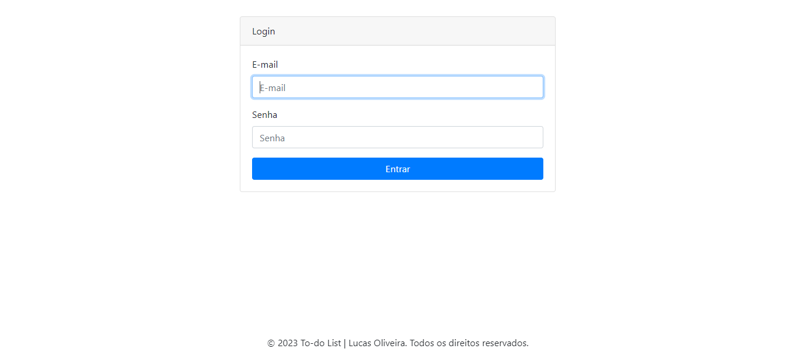
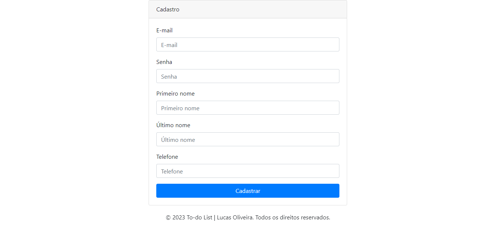
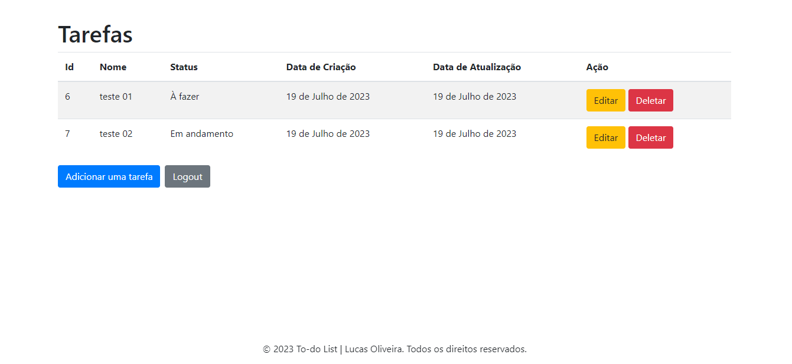
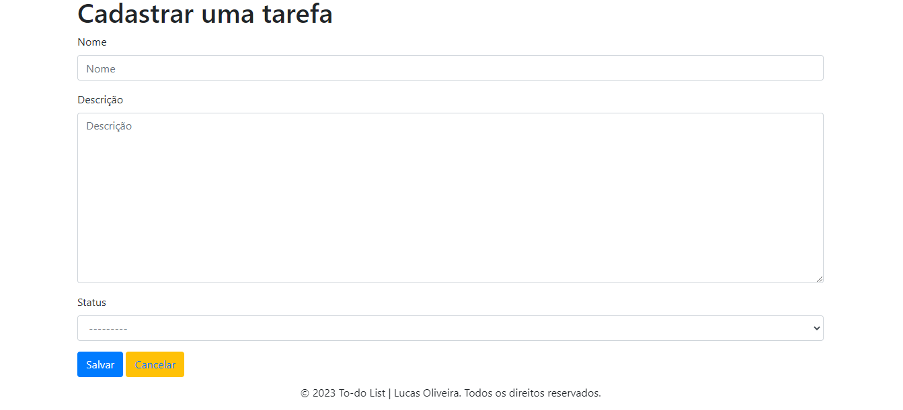
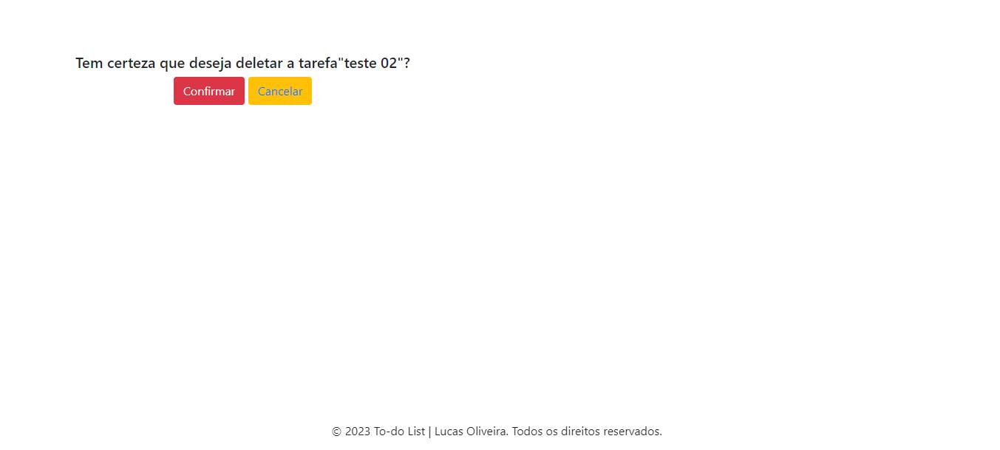

# To-do List.

Nesse repositório contém um projeto fullstack realizado o front-end com o BootStrap 4 e o back-end com python e o framework Django.

Desenvolvi esse projeto com o intuito de aplicar conhecimentos sobre class based views.

O projeto consiste em um sistema (CRUD) to-do list, onde o usuário do sistema consegue realizar login no sistema,
cadastrar-se como novo usuário, cadastrar tarefas, editar, deletar e visualizar todos as tarefas cadastradas em uma tela principal onde as tarefas são apresentadas em uma tabela.

### Pré-requisitos

- Python
- O banco de dados é de sua escolha, mas nesse projeto utilizei o SQLite
- Instalação dos requirements.txt disponibilizados

### Execução do sistema

- Basta entrar no diretório do sistema e no terminal rodar o comando: python manage.py runserver
e o retorno é o http da página (index);
- Para acessar as outras rotas do sistema terá que colocar a url manualmente como está no exemplo logo abaixo.

### Exemplo da execução

#### Rota para login (accounts/login/);

- Consta algumas validações, o formulário tem que estar preenchido
e com os dados certos para a liberação do acesso.

#### Rota para cadastro de usuário (accounts/registro/);

- Consta algumas validações, o formulário tem que estar preenchido
e com os dados certos para a liberação do acesso.

#### Rota para o dashboard (localhost/tarefas/);

- Obs: essa rota é acessível se o usuário estiver logado.
Aqui é onde o usuário LOGADO consegue realizar todas as opereções do sistema.

#### Rota para cadastrar tarefas (localhost/tarefas/add);

-  Aqui é onde o usuário LOGADO consegue realizar o cadastro e também editar a tarefa, pois usa o mesmo formulário.

#### Rota para excluir uma tarefas (localhost/deletar/);

-  Aqui é onde o usuário LOGADO consegue realizar a exclusão da tarefa.

