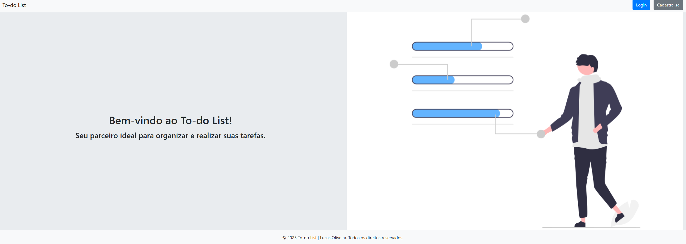
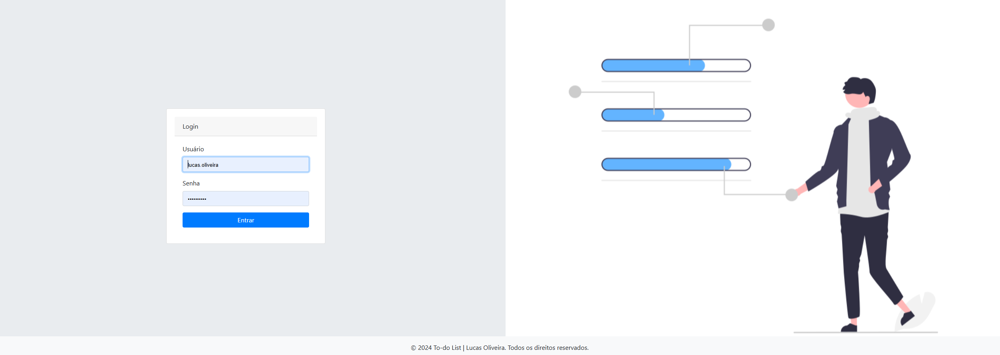
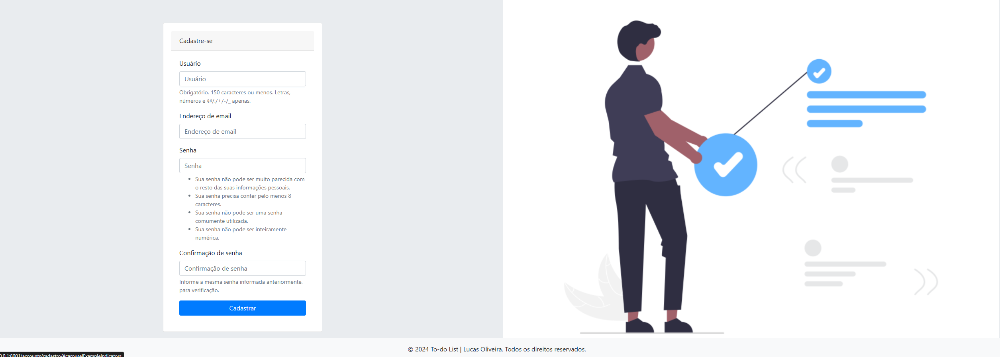
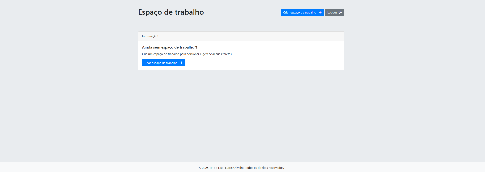
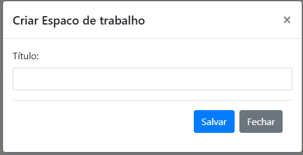
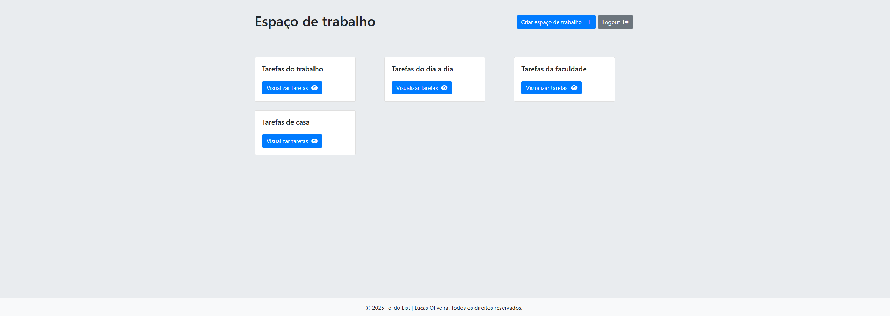
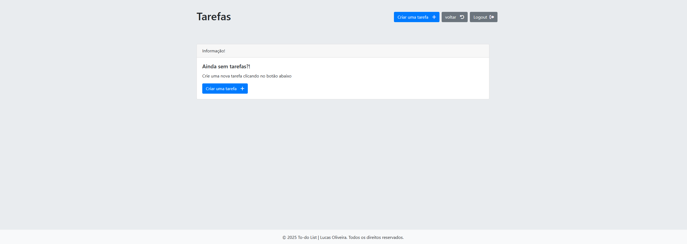
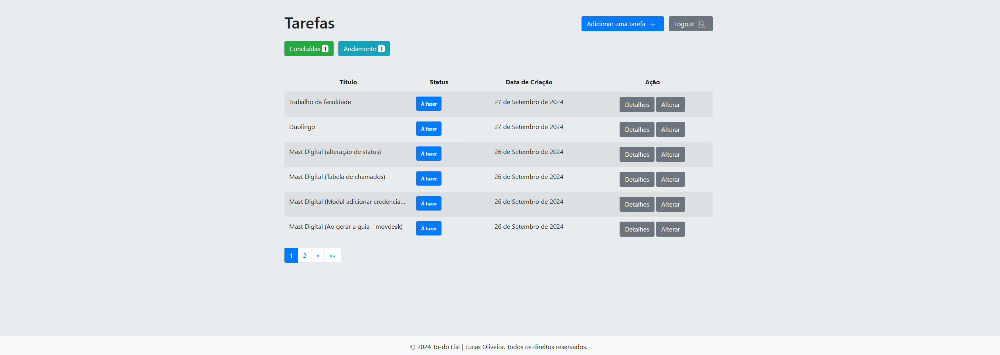
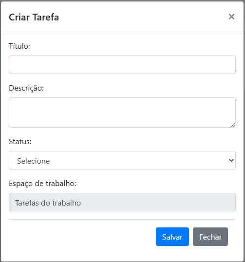
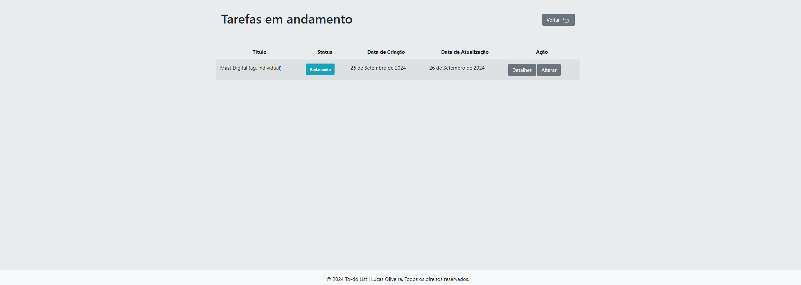

# To-do List.

Nesse repositório contém um projeto fullstack realizado o front-end com Html, Css, BootStrap 4, JavaScript e o back-end com Python e o framework Django.

O projeto consiste em um sistema to-do list, onde o usuário do sistema consegue realizar login no sistema,
cadastrar-se como novo usuário, cadastrar espaço de trabalho, cadastrar tarefas, editar, deletar e visualizar todos as tarefas concluidas, em andamento e pausadas em uma tela 
onde as tarefas são apresentadas em uma tabela. As tarefas são organizas em um espaço de trabalho, onde o usuário pode criar quantos quiser e separar suas tatarefas como por exemplo: Tarefas do dia a dia, faculdade e etc. 

<br>

<h2>Pré-requisitos</h2>

- [Docker](https://www.docker.com/) 

<br>

<h2>Clone</h2>

```bash
git clone https://github.com/lucas-ioliveira/to_do_list_django.git
```

<br>

<h2 id="started">🚀 Primeiros passos</h2>

<p>Basta entrar no diretório do projeto e no terminal rodar o comando:</p> 


```bash
docker compose -f docker-compose.yml up -d --build
```

<p>Isso fará com que todas as dependências sejam instaladas e um container docker seja executado.</p>

<br>

<p>Verifique se o container está em execução com o comando:</p>

```bash
docker ps -a
```

<br>

<h2 id="routes">📍Rotas</h2>

<p>As páginas são acessíveis somente com o usuário autenticado, obviamente, a home, login e cadastro são de livre acesso.</p>

<br>

**Home**

<p>Página inicial simples com botões para direcionar o usuário para login/cadastro.</p>



<br>

**Login**

<p>Consta algumas validações, o formulário tem que estar preenchido e com os dados certos para a liberação do acesso.</p>



<br>

**Cadastro de usuário**

<p>Consta algumas validações, o formulário tem que estar preenchido e com os dados certos para realizar o cadastro.</p>



<br>

**Espaço de trabalho**

 <p>Quando realizado o primeiro login no sistema, aparece o card informativo para criar um espaço de trabalho onde as tarefas ficarão organizadas.</p>



<br>

**Cadastrar um espaço de trabalho**

 <p>Para criar uma tarefa é necessário criar um espaço de trabalho antes para que as tarefas fiquem organizadas
 por "módulos".</p>



<br>

**Espaço de trabalho**

 <p>Dashboard para visualizar espaços de trabalhos cadastrados, a partir dele as tarefas são criadas e organizadas em cada espaço.</p>



<br>

**Tarefas**

 <p>Caso não tenha nenhuma  tarefa cadastrada é mostrado um card informativo.</p>



<br>

 <p>Dashboard para visualizar as tarefas que precisam ser realizadas ou em outro status. Nessa tela o usuário pode realizar algumas ações.</p>



<br>

**Cadastrar tarefas**

<p>Realizar o cadastro ou editar a tarefa, pois usa o mesmo formulário.</p>



<br>

**Visualizar as tarefas concluídas**


<br>

**Visualizar as tarefas em andamento**



<br>

**Modal detalhes**

<p>Ao clicar no botão detalhes sobe um modal com as informações da tarefa.</p>


