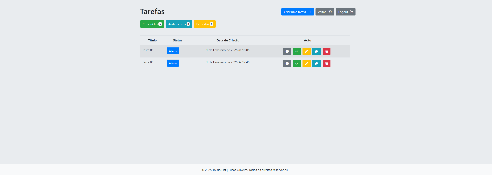
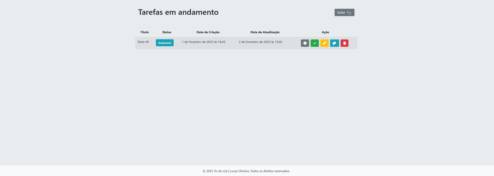
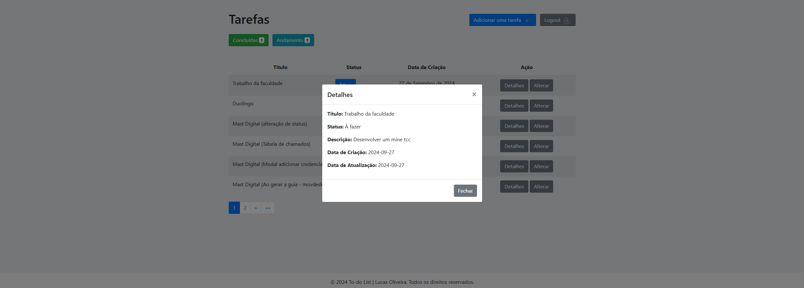

# To-do List.

Nesse repositório contém um projeto fullstack realizado o front-end com Html, Css, BootStrap 4 e o back-end com Python e o framework Django.

O projeto consiste em um sistema to-do list, onde o usuário do sistema consegue realizar login no sistema,
cadastrar-se como novo usuário, cadastrar espaço de trabalho, cadastrar tarefas, editar, deletar e visualizar todos as tarefas concluidas, em andamento e pausadas em uma tela 
onde as tarefas são apresentadas em uma tabela. As tarefas são organizas em um espaço de trabalho, onde o usuário pode criar quantos quiser e separar suas tatarefas como por exemplo: Tarefas do dia a dia, faculdade e etc. 

### Pré-requisitos

- Python instalado;
- Criação do ambiente virtual (Linux: python3 -m venv venv ou no Windows: python -m venv venv);
- Ativação do ambiente criado anteriormente (Linux: source venv/bin/activate ou no Windows: venv\Scripts\activate);
- Instalação dos requirements.txt disponibilizados (pip insall -r requirements.txt);
- O banco de dados é de sua escolha, mas nesse projeto utilizei o SQLite (Caso escolha um banco de dados diferente do padrão não esqueça de realizar as alterações no arquivo settings.py);
- OBS¹: Caso tenha o Docker intalado será o suficiente e apenas precisará rodar o docker compose disponibilizado
(No diretório do projeto rodar o comando: docker compose -f docker-compose.yml up -d --build);
- OBS²: Caso opte por rodar o projeto sem usar o docker, é necessário remover algumas configurações de variáveis de ambiente existente no settings.py e deixar padrão;

### Execução do sistema

- Basta entrar no diretório do projeto e no terminal rodar o comando: python manage.py runserver ou docker compose -f docker-compose.yml up -d --build;
- O servidor será executado e se acessar localhost:8000 acessará a página inicial do sistema onde poderá realizar o cadastro ou o login;

### Exemplo da execução

- Obs: As páginas são acessíveis somente com o usuário autenticado, obviamente, login e cadastro são de livre acesso.

#### Rota para a página inicial;

- Página inicial simples com botões para direcionar o usuário para login/cadastro.

#### Rota para login (accounts/login);

- Consta algumas validações, o formulário tem que estar preenchido
e com os dados certos para a liberação do acesso.

#### Rota para cadastro de usuário (accounts/registro);

- Consta algumas validações, o formulário tem que estar preenchido
e com os dados certos para a liberação do acesso.

#### Rota para  espaço de trabalho (/tarefas/espaco-trabalho/);

 - Quando realizado o primeiro login no sistema, aparece o card informativo para criar um espaço de trabalho onde as tarefas ficarão organizadas.

#### Rota para o cadastrar um espaço de trabalho (/tarefas/espaco-trabalho/cadastrar/);

 - Para criar uma tarefa é necessário criar um espaço de trabalho antes para que as tarefas fiquem organizadas
 por "módulos".

#### Rota para o espaço de trabalho (/tarefas/espaco-trabalho/);

 - Dashboard para visualizar espaços de trabalhos cadastrados, a partir dele as tarefas são criadas e organizadas em cada espaço.

#### Rota para o dashboard (/tarefas);

 - Caso não tenha nenhuma  tarefa cadastrada é mostrado um card informativo.

#### Rota para o dashboard (/tarefas);

 - Dashboard para visualizar as tarefas que precisam ser realizadas ou em outro status. Nessa tela o usuário pode realizar algumas ações.

#### Rota para cadastrar tarefas (/tarefas/cadastrar) ou editar (/tarefas/atualizar/id/);

- Realizar o cadastro ou editar a tarefa, pois usa o mesmo formulário.

#### Rota para visualizar as tarefas concluídas (tarefas/concluidas);

- Visualizar tarefas concluidas.

#### Rota para visualizar as tarefas em andamento (tarefas/andamento);

- Visualizar tarefas em andamento.

#### Modal detalhes;

- Ao clicar no botão detalhes sobe um modal com as informações da tarefa.

